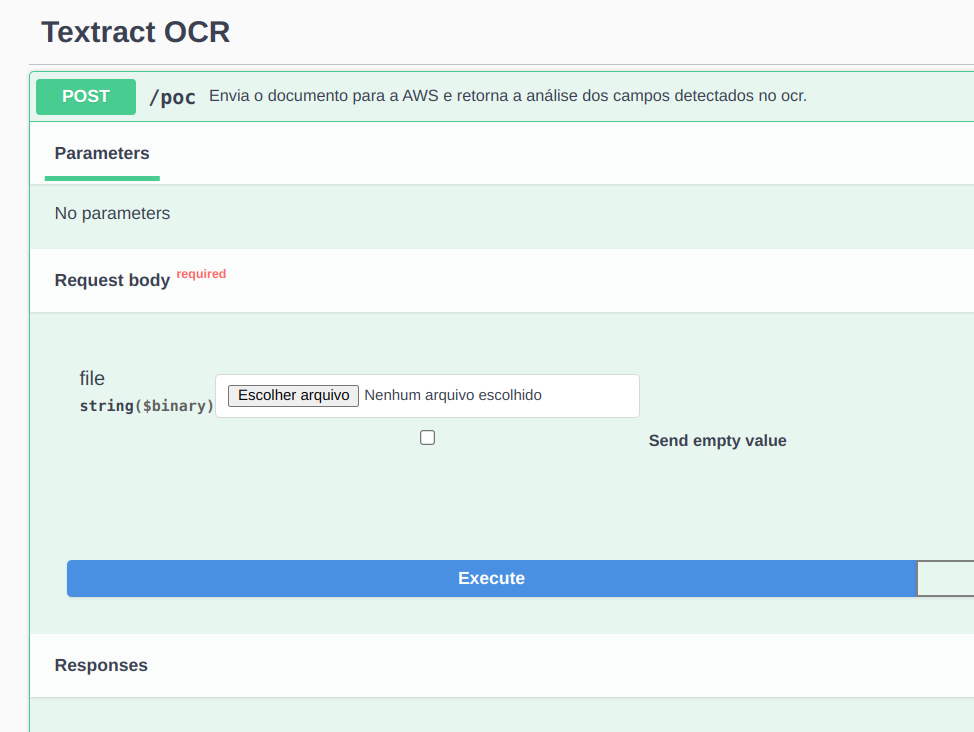

# ANÁLISE OCR UTILIZANDO [AMAZON TEXTRACT](https://docs.aws.amazon.com/textract/index.html)


## Sobre

Esta é uma PoC que desenvolvi para demonstrar uma forma de utilizar o Amazon textract como um serviço utilizando uma API Rest construída com Nestjs.
O objetivo é submeter um arquivo pdf ou imagem, fazer a análise de OCR e então processar a resposta gerando como resultado uma combinação de chave:valor dos dados encontrados dentro do arquivo enviado.

## Referências

https://docs.aws.amazon.com/textract/latest/dg/examples-extract-kvp.html


## Testando

Prepare a aplicação
```sh
nvm use
npm install
```

crie seu arquivo .env conforme o exemplo disponível aqui e preencha com suas credenciais da AWS com permissoes para uso do textract.

Inicie a aplicação
```sh
npm start
```

Acesse a url http://localhost:3000


Selecione um arquivo de imagem ou pdf que quer analisar


Execute
